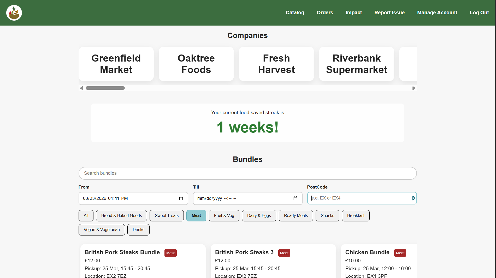
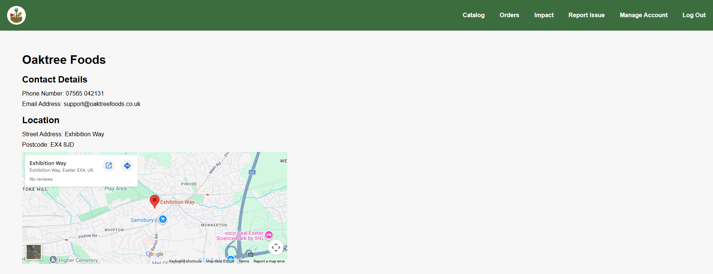
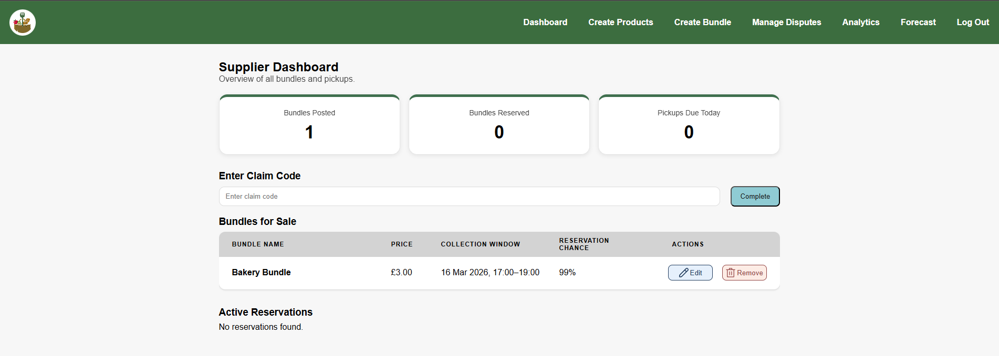
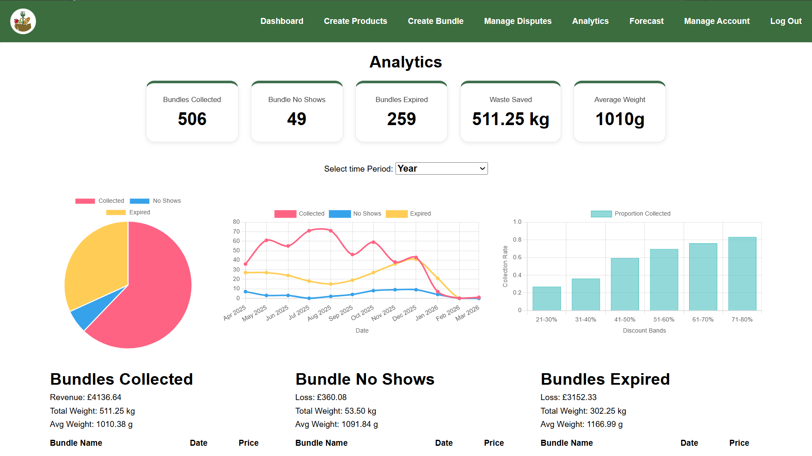
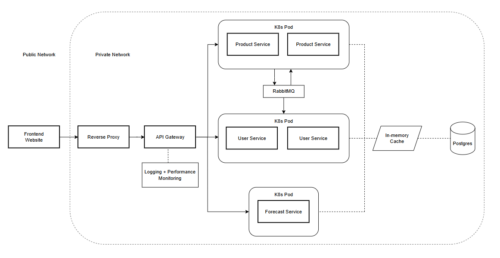

# The Last Fork
_By Team Tiger_

Our website aims to help companies reduce food waste by allowing them to resell it to customers at a reduced price.

## Website Preview

  
  
  
  

## Tech Stack

### Languages

### Frameworks

### Data Management

### Testing

### Machine Learning

### Deployment

### DevOps Tools

## API Documentation

**User Service**

**Product Service**

**Forecast Service**

## Architecture

  

# Contributions

## Backend Services  

### API Gateway
**Author: Daniel Jackson**
- Setup this routing service to manage sending request to the right service, using pattern matching based on the URL.
- Configured CORS so the production website and development environments can send requests to the backend.
- Setup Authentication Security Filter that:
  - Verifies token signature for authenticity
  - Verifies token has not expired
  - Written explicit paths that are exempt from authentication (E.G Endpoint Documentation Website)
  - Used Maven Licensing Plugin to check permissions of dependency licenses (Software Inventory)
  - Created README file to show details about the repository

 

### User Service
**Author: Daniel Jackson**
- Setup Authentication Components:
    - Created Refresh and Access Token Generation using Secret Key
    - Created methods to extract user type and Id from access token
    - Created endpoint for users and vendors to refresh their access token
- Setup User Components:
    - Created User Endpoints and specified the data required in the request
    - Validated incoming request data at the DTO layer
    - Defined the User and Streak database tables and linked them using Spring Boot JPA
    - Wrote custom SQL queries using JPARepository
    - Wrote business logic in the service layer that accesses the database
    - Defined Custom Exceptions to improve visibility in the logs
    - Setup a RabbitMQ Listener that receives updates to the streak
    - Created a Component that generates a unique username using random adjectives and nouns
    - Setup Endpoints to modify account data and allow the user to delete their account
    - Setup an endpoint so the user can logout
- Setup Vendor Components:
    - Created Vendor Endpoints and specified the data required in the request
    - Validated incoming request data at the DTO layer
    - Defined the Vendor database table using Spring Boot JPA
    - Wrote business logic in the Vendor Service layer that accesses the database
    - Setup Endpoints to modify account data and allow the vendor to delete their account
    - Setup an endpoint so the vendor can logout
- Setup Dispute Components:
    - Created Endpoints for Users to submit a dispute against a vendor
    - Created Endpoints for Vendors to Respond to disputes made against them
- Setup User Impact Component:
    - Setup Badge Endpoints and RabbitMQ listeners to update badges on reservation collection
    - Setup Leaderboard endpoint so show top 10 users and users position
- Added OpenAPI documentation to improve visibility of the backend for the front-end developers
- Enforced Controller-Service-Repository model to improve consistency across services for developers
- Setup Spring Boot Profiles to manage configurations for production, development and testing environments
- Used Maven Licensing Plugin to check permissions of dependency licenses (Software Inventory)
- Used Maven Dependency Security Plugin to Audit Dependencies for Security Vunerabilities
- Setup Redis Cache Configuration and Cached Popular Endpoints
- Created README file to show details about the repository
- Added Comments and Javadocs to improve readability of code

 

**Author: Robert Rainer**
- Added endpoints for User Impact
  - Created endpoint to get money saved
  - Created endpoint to get waste saved
  - Created endpoint to get total orders
- Added API Documentation to increase visibility of Endpoints on Swagger

 

**Author: Jed Leas**

- Setting up all CI/CD workflows to handle
  1. Automatic testing on push of main branch on the User Service repo
  2. Automatic Deployment onto k3s on completion of automatic testing so broken code won't make it to deployment
- Set up the connection to the PostgreSQL database, and RabbitMQ
- - Added SpotBugs Dependancy to perform SAST
- - Added Liveliness checks to workflow for zero downtime Deployment
- - Fixed countMoneySaved and countMoneySavedForTimePeriod sql queries
- Helped Review PR's

 

### Product Service 
**Author: Robert Rainer**
- Developed Product and Allergen Components:
   - Created Product REST Endpoints and specified the data required in requests    
   - Implemented Product Service Layer with JWT ownerships checks
   - Implemented Product–Allergen many-to-many relationship mapping
   - Designed and implemented the DTO layer for product operations
   - Implemented ProductService interface and ProductServiceJPA service layer
   - Wrote business logic in Product Service Layer that accesses the database
   - Developed ProductMapper to convert entities into DTOs 
   - Created repository interfaces for Product and Allergy database operations
- Commented Product Service
- Added API Documentation to increase visibility of Endpoints on Swagger    

 

**Author: Daniel Jackson**
- Led code structure discussions with Robert Rainer about using the MVC model
- Setup Bundle Components:
    - Created Bundle Endpoints and specified the data required in the request
    - Created endpoints that support pagination for SQL queries
    - Validated incoming requests data at the DTO layer
    - Wrote SQL Queries that joined multiple tables
    - Defined Bundle and BundleProducts (joining table) database tables using Spring Boot JPA
    - Wrote business logic in Bundle Service Layer that accesses the database
    - Defined Custom Exceptions to improve visibility in the logs
    - Created endpoints so the vendors can edit/delete bundles
- Setup Reservation Components:
    - Created Reservation Endpoints and specified the data required in the request
    - Validated incoming request data at the DTO layer
    - Defined Reservation and Claim code database tables and linked them
    - Defined RabbitMQ configuration and published messages to the queue
    - Defined Custom Exceptions to improve visibility in the logs
    - Wrote business logic in the Reservation Service Layer that accesses the database
    - Setup a delayed queue (RabbitMQ) to automatically handle No-Shows
- Added OpenAPI documentation to improve visibility of the backend for the front-end developers
- Enforced Controller-Service-Repository model to improve consistency across services for developers
- Used Maven Licensing Plugin to check permissions of dependency licenses (Software Inventory)
- Used Maven Dependency Security Plugin to Audit Dependencies for Security Vunerabilities
- Setup Redis Cache Configuration and Cached Popular Endpoints
- Created README file to show details about the repository

  

 **Author: Jed Leas**
- Setting up all CI/CD workflows to handle
  1. Automatic testing on push of main branch on the Product Service repo
  2. Automatic Deployment onto k3s on completion of automatic testing so broken code won't make it to deployment
- Set up the connection to the PostgreSQL database, and RabbitMQ
- - Added SpotBugs Dependancy to perform SAST
- - Added Liveliness checks to workflow for zero downtime Deployment
- Helped Review PR's

**Author: Alex Greasley**
- Helped review pull requests

 

### Forecast Service
**Author: Alex Greasley**
- Created the scripts used for generating seeded data, simulating realistic user behaviour to establish trends for the ML models.
- Wrote scripts that cleaned and denormalised relational data to prepare it for bulk transfer into the production database.
- Developed the Machine Learning training pipeline, including data preprocessing, feature engineering, and the training of the Voting classifiers used for predicting reservations and collections.
- Implemented Sentence Transformer to preprocessing pipeline, enabling the model to handle unknown weather conditions.
- Built the Forecast Service API, using FastAPI to create the /predict, /simulate, /production-advice, and /optimise endpoints and authorised them using JWT Auth.
- Integrated the Weather API to fetch historical data for model training and real-time conditions for predicting reservations and collections.
- Co-Developed unit and integration tests using pytest and FastAPI TestClient with Jed Leas.
- Reviewed pull requests.

 

**Author: Jed Leas**

- Setting up all CI/CD workflows to handle.
    1. Automatic testing on push of main branch on the forcast service repo.
  2. Automatic Deployment onto k3s on completion of automatic testing so broken code won't make it to deployment.
- And Sorting out bug fixes and connections between each microservice's to the forecast service and set up the connection to the postgre database.
- Added input validation to the /optimise endpoint.
- Co-Developed unit and integration tests using pytest and FastAPI TestClient with Alex Greasley.
- Helped with bug fixing of Auth and Forecast service.
- Removed all returning of Specific Errors.
- Added input validation to simulate endpoint.
- Reviewed Pull Requests.
- Optimized Image to ignore specific files and only have a single copy of the dependencies as that reduced image size from approximately 35GB to 15GB.

 

**Author: Daniel Jackson**
- Used pip-licenses to check permissions of python module licenses (Software Inventory).

 

## Website 
**Author: Toby Beckett**
- Created the Lofi Designs for the Login (supplier and user), register(Supplier and user), Orders, catalog, impact, and the report issue pages that are all on the user side of the website
- Created the user Login page: HTML, CSS and JavaScript
- Created the user Signup page: HTML, CSS and JavaScript
- Created the supplier Login page: HTML, CSS and JavaScript
- Created the supplier Signup page: HTML, CSS and JavaScript
- Created the users Catalog page: HTML, CSS and JavaScript
- Created the users Orders page: HTML, CSS and JavaScript
- Created the suppliers forecast page: HTML, CSS and JavaScript
- Created the index page: JavaScript and HTML
- Created the README file for the front end repository
- Added keyboard navigation to all pages
- Made all pages have the required WCAG accessibility colour contrast and text size
- Created the user impact page: HTML, CSS, JS
  - Added badges
  - Waste and Money leaderboards
  - Personnel impact summary
- Created the user disputes page so the user could start disputes based on bundles they have collected/reserved/noshow: HTML, CSS, JS
- Created search bar and filter catalog page
- Made all pages resistant to XSS through sanitization of displaying any user inputted information
- Created manage account page: HTML, CSS, JS
  - change email
  - change password
  - delete account
- Ensuring all pages and new ones are mobile accessible
- Added labels to the frontend pages for screen reading capability 

**Author: William Foulger**
- Created the Lofi designs for the Dashboard, Create Product, and Analytics pages
- Created the supplier Dashboard page: HTML, CSS, JavaScript
- Created the supplier Create Products page: HTML, CSS, JavaScript
- Created the supplier Create Bundles page: HTML, CSS, JavaScript
- Created disputes page: HTML, CSS, JavaScript
- Created manage vendor account page: HTML, CSS, JavaScript
  - Change vendor details (company name, email address, street address, postcode, phone number, description)
  - Change email
  - Change password
  - Delete account
- Adding screen reader accessibility to vendor pages
- Ensuring all pages and new ones are mobile accessible
- Rework the create bundle page
  - Implement the optimise button
  - Scrollable product page
  - Search bar for products

**Author: Daniel Jackson**
- Integrated the Authentication Mechanism into the Website
  - Created a check to see if the access token is valid
  - Created standard POST and GET methods with retry mechanisms
- Created the Vendor Page
  - Created Display for Vendor Information and Google Map Embed
  - Created List of Available Bundles with Drop-Down for Product List
- Created Standard Header and Footer for all Web pages
- Created Analytics page so Vendor's can see bundle performance across different time spans
- Created the badges

**Author: Alex Greasley**
- Created Lofi designs for Forecast, Simulate, and Create Bundle pages
- Created the supplier Forecast page: HTML, CSS, JavaScript
- Created the supplier Simulate page: HTML, CSS, JavaScript
- Made minor adjustments across the frontend to improve UX

**Author: Jed Leas**
Added minor bug fixes and features which included:
- Analytics page
  - Discount sell through rates graph
  - Average weights in summary box
  - Weights and Average weights in the raw data for:
    - Collected Bundles
    - No Show Bundles
    - Expired Bundles
  - Added mobile friendly formating
- Catalog Page
  - Adjusted disclaimer popup to include link to our Food Safety & Allergies page
  - Added Filter for location
  - Added filters for Start and End time
- New Bundle Page
  - Disabled create new bundle while waiting for response
  - Added popup to make new bundle creation more clear
- Supplier Register Page
  - Fixed phone number length constraint
  
 

## DevOps
**Author: Jed Leas**
- My focus has been setting up the instances of the achirtecture designed by Daniel Jackson which included setting up the:
  - Nginx (Reverse proxy)
  - K3s
  - Postgres
  - RabbitMQ
  - Nginx (Website hosting)
- As well as setting up all CI/CD workflows to handle 
  - Automatic testing on push of main branch on each microservices repo
  - Automatic Deployment onto k3s with zero downtime on compleation of automatic testing so broken code wont make it to deployment
- And Sorting out bug fixes and connections between each microservices to eachother and the databases for both deployment and testings
- Performed SAST:
    - Spot Bugs for Java Microservices
    - Bandit for Python Microservices (Forecast Service)
- Performed DAST using ZAP
- Implemented Zero downtime deployment using liviness checks
- Optimized ForecastService Image to ignore specific files and only have a single copy of the dependancies as that reduced image size from aproximatley 35GB to 15GB

 

## Testing
**Author: Ivy Figari**
- Unit tests
    - User controller: successful user registration, user registering with email already in use, successful user login, password incorrect login, email doesnt exist login
    - User services: successful login, creating invalid user profile with taken email, retireiving user from repository, using an email that doesnt exist,
    - Vendor services: creating a vendor successfully, trimmed
- Integration tests
    - Initial streak is 0 when user registers, streak is then 1 after first purchase
    - 2 reservations made the same day the streak doesnt increase twice
-  documentation: initial evaluation, test_evidence.pdf

 

## Documentation

**Author: Daniel Jackson**
- Wrote the Architecture descriptions
  - Created the Entity-Relationship Diagram
  - Created the overall backend architecture diagram
  - Wrote about each service and the overall data flow through our system
  - Wrote about architectural decisions we made and their impact
  - Explained the rationale behind choosing our languages and frameworks
- Made the Software/Data Licensing document
- Wrote about next steps for the project
- Wrote about how to audit the java dependencies for security vulnerabilities 

 

**Author: Alex Greasley**
- Wrote Data Seeding description
  - Explained each tables generation
  - Discussed early versions and improvements made
  - Justified decisions made
- Wrote Forecast Model description
  - Explained preprocessing techniques used
  - Discussed previous models used and improvements made
  - Justified decisions made
  - Highlighted areas for improvement
- Wrote Forecast Endpoints descriptions
  - Discussed /predict, /simulate, and /optimise endpoints
  - Explained how each works
- Wrote Process Evidence
  - Discussed Role Allocation
  - Explained Task Management
  - Discussed Risk Management
- Wrote Risk Register
- Wrote Scrum Board Export

 

**Author: Jed Leas**
- Wrote Prioritized Requirements
  - Created User Stories based on:
    - Project Requirements
    - Teams goals 
  - Created Criteria to judge if requirements have been met
  - Created Traceability to instruct a person how to independently verify if we met our specified requirements
- Wrote Sprint Two Plan
  - Spoke to every group members about:
    - Their goals for sprint two
    - What they want to work on
    - If they want to do something else or stay in their role
  - Compiled this information into:
      - The user story’s
      - Story point estimations
      - Who’s going to be working on what
      - Technical Rational if needed
- Authored:
  - security_checklist.pdf
  - maintenance_and_troubleshooting.pdf
  - deployment_and_operations.pdf
  - Evalutation of sprint two goals
 

**Author: Toby Beckett**
- Wrote the Executive Summary
- Wrote the front-end design section
  - Drew the front end lofi designs for the user pages
  - Drew the front end lofi designs for the login/register page for the Users/Vendors
  - Created the initial powerpoint template
  - Write the front end explanation
 

**Author: Robert Rainer**
- Wrote the Problem Statement
  - Researched food waste statistics and impact
  - Identified root causes of food waste within context
  - Investigated problems with existing systems/platforms
  - Addressed project scope and limitations

 

**Author: Ivy Figari**
- Wrote testing_evidence.pdf
  - Explained manual end to end tests
  - Explained automated tests, unit tests, and integration tests
- Wrote Evaluation
  - Wrote Initial Evaluation Evidence
  - Wrote Scope Control

 

**Author: Oscar De Lemos**
- Reviewed and refined the risk register to ensure risks and mitigations fit the final platform.
- Updated multiple risks, especially expanding mitigation explanations.
- Added a few risks with details to the risk register.
- Produced the website footer content, which includes: Terms of use, privacy policy, food safety & allergies statements, cookies statement, accessibility statement, licencing statement.
 

## Ethical and Legal considerations
**Author: Oscar De Lemos**
- Produced the full Ethical and Legal considerations document covering food safety, allergen disclosure, consumer fairness, gamification risks, accessibility, environmental impact, privacy, security, intellectual property and data licensing.
- Described the food safety responsibilities and liabilities of the platform, sellers, and users.
- Identified key risks such as misleading listings, allergen inaccuracies and potential data exposure, and documented approaches the platform implements to mitigate these risks.
- Wrote the website footer policy content, including: Terms of Use, Privacy Policy, Food Safety & Allergy statements, Cookies statement, and Accessibility Statement including known limitations.
- Produced the Ethics Approval Statement, explaining why ethics approval was not required.
 

## License Decision 
**Author: Oscar De Lemos**
- Researched multiple potential licences, comparing their benefits and limitations.
- Selected MIT Licence as the project's licence following my assessment.
- Wrote the licence decision with justification, explaining the licence's suitability and compatibility with third party dependencies.
- Configured and inserted the MIT LICENSE file across all project repositories.
 

## Data Storage and Usage
**Author: Oscar De Lemos**
- Produced the Data Storage and Usage document describing what personal and operational data the platform stores and uses.
- Documented the data collected from consumers, vendors, and platform activity.
- Explained why each type of data is collected.
- Documented the platform’s data protection approach, and how we followed GDPR principles.
- Wrote the sections describing how data is protected.
- Documented data retention, third-party access limits, and the use of synthetic and real-world non-identifying data such as weather inputs.
 
